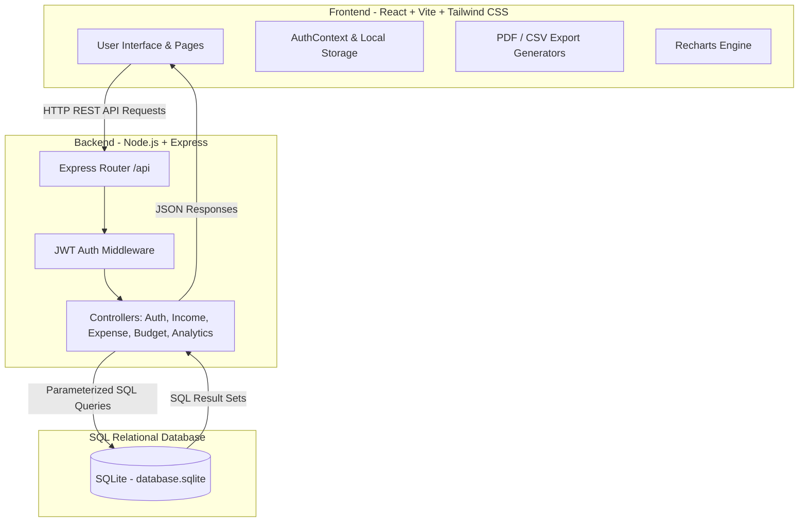
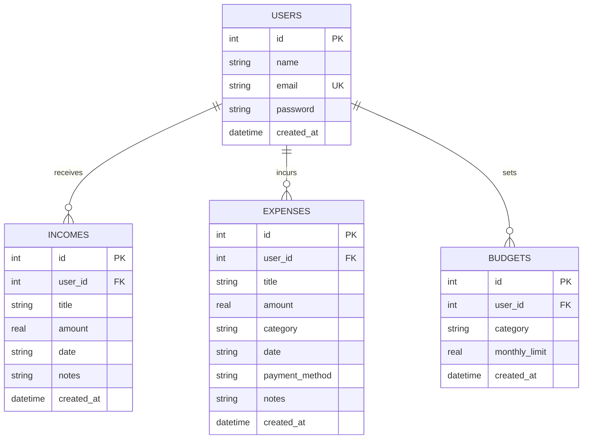

# 💰 SpendWise - Complete Multi-User Expense Tracker

A full-stack, responsive, and secure **Multi-User Expense Tracker Web Application** built with Node.js, Express, SQLite, React, and Tailwind CSS. Track salaries, manage itemized spending, set budget alerts, analyze interactive charts, and export financial statements in **PDF** and **CSV** formats.

---

## 🌟 Key Features

- 🔒 **Multi-User Authentication & Data Isolation**:
  - Sign up & Sign in with Email (Gmail format validation) and Password.
  - Password hashing with `bcryptjs` and stateless session security with `jsonwebtoken` (JWT).
  - Strict SQL data isolation (`WHERE user_id = ?`) ensuring every user sees only their own data.
- 💵 **Salary & Income Management**:
  - Log monthly salary, freelance earnings, bonuses, or investment returns.
  - Real-time balance calculation (`Remaining Balance = Total Income - Total Expenses`).
- 🛒 **Itemized Expense Tracking**:
  - Record title, amount, category, date, payment method, and additional notes.
  - Quick Search & Filter by keyword, category, payment mode, or date ranges.
- 📊 **Interactive Analytics & Financial Charts**:
  - Donut chart for category spending distribution.
  - Monthly trends area/bar chart comparing income vs expenses.
  - Key insights (Top spending category, savings efficiency percentage).
- 📄 **Statement Generation & Export**:
  - Export custom date-range statements as professionally formatted **PDF reports** (invoice-style layout).
  - Export spreadsheets in **CSV format** for Excel and Google Sheets.
- ⚠️ **Budget Limit Targets & Warning Alerts**:
  - Set monthly budget caps for individual categories.
  - Visual progress indicators: **Green** (Within Budget), **Amber** (Near Limit - 80%+), **Red** (Over Budget - 100%+).
- 🌓 **Dark & Light Mode Support**:
  - Toggle between dark and light themes seamlessly.

---

## 🏗️ Technology Stack & Installed Libraries

### 1. Frontend Stack & NPM Libraries
- **Framework**: `React 18` (JavaScript ES6+) built with `Vite`.
- **Styling**: `Tailwind CSS v4` (`@tailwindcss/vite`).
- **Icons**: `Lucide React` (`lucide-react`).
- **Data Visualization**: `Recharts` (`recharts`) for interactive pie, donut, bar, and area charts.
- **HTTP Client**: `Axios` (`axios`) with request/response interceptors for JWT auth headers.
- **Statement Exporters**:
  - `jsPDF` (`jspdf`) & `jspdf-autotable` for generating styled PDF statement documents.
  - `PapaParse` (`papaparse`) for converting expense JSON objects into downloadable CSV spreadsheets.

### 2. Backend Stack & NPM Libraries
- **Server Framework**: `Node.js` & `Express.js` (`express`).
- **Database Driver**: `SQLite3` (`sqlite3`) for zero-configuration persistent SQL storage.
- **Security & Authentication**:
  - `jsonwebtoken` (JWT) for stateless bearer token authentication.
  - `bcryptjs` for salted password hashing.
- **Middleware & Helpers**:
  - `cors` for Cross-Origin Resource Sharing.
  - `dotenv` for environment configuration variables.

### 3. Database Layer
- **SQLite 3**: Embedded relational database (`database.sqlite`). Self-initializes all tables (`users`, `incomes`, `expenses`, `budgets`) on first launch with foreign key constraints enabled.

---

## 📐 System Architecture



---

## 🗄️ Entity Relationship (ER) Diagram



---

## 📋 Requirements Specification

### 1. Functional Requirements (FR)
- **FR-01 (Authentication)**: User must be able to register with Full Name, Email, and Password (min 6 chars). Email must follow standard format.
- **FR-02 (Login/Logout)**: User must be able to log in with valid credentials, receive a JWT token, and log out cleanly.
- **FR-03 (Data Security)**: User A cannot view, modify, or delete User B's records under any circumstances.
- **FR-04 (Income Management)**: User can record income entries with title, amount, date, and notes.
- **FR-05 (Expense Management)**: User can record expenses with title, amount, category, date, payment method, and notes.
- **FR-06 (Filtering & Search)**: User can filter expenses by keyword, category, payment method, and date range.
- **FR-07 (Budgets & Alerts)**: User can define category monthly limits and receive visual warning indicators when spending exceeds 80% or 100%.
- **FR-08 (Statement Export)**: System must generate downloadable PDF statements (with formatted tables) and CSV spreadsheets.
- **FR-09 (Analytics)**: System must display real-time pie charts, trend lines, and summary cards.

### 2. Non-Functional Requirements (NFR)
- **NFR-01 (Performance)**: API responses must complete within < 100ms for database queries.
- **NFR-02 (Security)**: Passwords must be hashed using `bcrypt` (10 rounds). Tokens expire after 7 days. SQL queries must be parameterized to prevent SQL Injection.
- **NFR-03 (Reliability)**: SQLite database must maintain transactional integrity with Foreign Key constraints enabled (`PRAGMA foreign_keys = ON`).
- **NFR-04 (Usability)**: Interface must be mobile-friendly and responsive across desktop, tablet, and smartphone screens.

### 3. Hardware Requirements
- **Processor**: Intel Core i3 / AMD Ryzen 3 or higher.
- **Memory (RAM)**: Minimum 2 GB (4 GB recommended).
- **Storage**: At least 200 MB free disk space.

### 4. Software Requirements
- **Operating System**: Windows 10/11, macOS, or Linux.
- **Runtime Environment**: Node.js (v16.0.0 or higher).
- **Package Manager**: npm (v8.0.0 or higher).
- **Browser**: Chrome, Edge, Firefox, Safari, or Brave.

---

## 🚀 Step-by-Step Setup Guide (For New Laptops)

If someone copies or clones this project to another laptop, follow these simple steps to get it running:

### Step 1: Prerequisites Check
Make sure **Node.js** (version 16 or higher) is installed on the laptop.
Check in terminal:
```bash
node -v
npm -v
```

### Step 2: Install Dependencies
Open terminal in the project root folder (`ex tr`):

1. **Install Backend Dependencies**:
   ```bash
   cd backend
   npm install
   ```

2. **Install Frontend Dependencies & Build UI**:
   ```bash
   cd ../frontend
   npm install
   npm run build
   ```

3. **Return to Root Folder**:
   ```bash
   cd ..
   ```

### Step 3: Run the Application

#### Option A (Windows 1-Click Launch):
Double click the **`run.bat`** file inside the project directory.

#### Option B (Terminal Command):
```bash
node backend/server.js
```
or
```bash
npm start
```

### Step 4: Open in Browser
Open your browser and navigate to:
```
http://localhost:5000
```

> **Note**: No external database setup or API keys are required. The SQLite database file (`database.sqlite`) will automatically create itself and manage all tables upon first run!

---

## 📜 License & Acknowledgments
Built with ❤️ for managing personal finances easily and securely.
